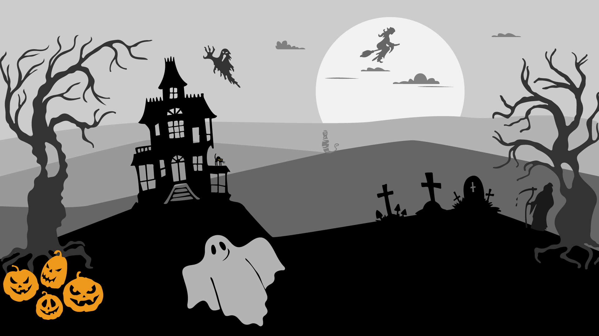
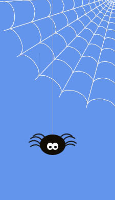

# Halloween-overlay
Envie d'égayer votre live pendant la période d'Halloween.
Cette toolbox est faite pour vous !

## Layer
Ce layer animé peut être utilisé en guise d'écran d'intro / d'attente / de fin de stream.

Pour le moment seul les nuages et la maison sont animés.

### Comment l'utiliser ?
- Sous OBS Studio, ajoutez une source de type navigateur dans votre scène
- Dans la fenêtre cliquez sur "Fichier local" et sélectionnez le fichier **src/scene.html**
- Indiquez 1920 en guise de largeur et 1080 en guise de hauteur
- Validez sur "ok"

### Sources
Encore merci à Lodiloee pour la composition graphique !

## Araignée
Une animation d'araignée qui monte et descend sur un fil tout en agitant ses nombreuses pattes avec une toile en coin.

### Comment l'utiliser ?
- Sous OBS Studio, ajoutez une source de type navigateur dans votre scène.
- Dans la fenêtre cliquez sur "Fichier local" et sélectionnez le fichier **src/araignée.html**
- Indiquez 228 en guise de largeur et 400 en guise de hauteur
- Validez sur "ok"

Vous pouvez maintenant positionner votre araignée sur le bord droit.
Pour positionner l'araignée sur la gauche, faites un clic droit sur la source puis sélectionnez 
**Transformez -> Inversez horizontalement**

### Sources
Cette animation a été faite à partir du code de Rachel Bull :
https://codepen.io/rachel_web/pen/rrRQYW

## Transition track matte de chauve-souris
Une transition track matte est une transition qui superpose les deux scènes, l'une se fondant dans l'autre en respectant
le calque défini dans la transition. Avec ce type de transition il n'est pas nécessaire de totalement recouvrir une scène
avant de passer à une autre.

Le fichier **transitions/bat-transition.webm** est un fichier vidéo utilisable en transition track matte.

### Comment l'utiliser ?
- Sous OBS Studio, dans la section "Transition de scènes", sélectionnez "Ajoutez: Stinger"
- Indiquez un nom de transition, par exemple : "Bat Transition"
- Dans la fenêtre sélectionnez le fichier vidéo
- Cochez l'option "Utiliser un cache de piste"
- Dans la "Disposition du cache" sélectionnez "Même fichier, empilé (stinger en haut, cache de piste en bas)"
- Cochez "Inverser les couleurs du masque"
- Pour une transition de son dans "Style de fondu audio" sélectionnez "Fondu enchaîné"
- Validez avec sur "ok"

La transition est maintenant disponible dans votre liste de transition.